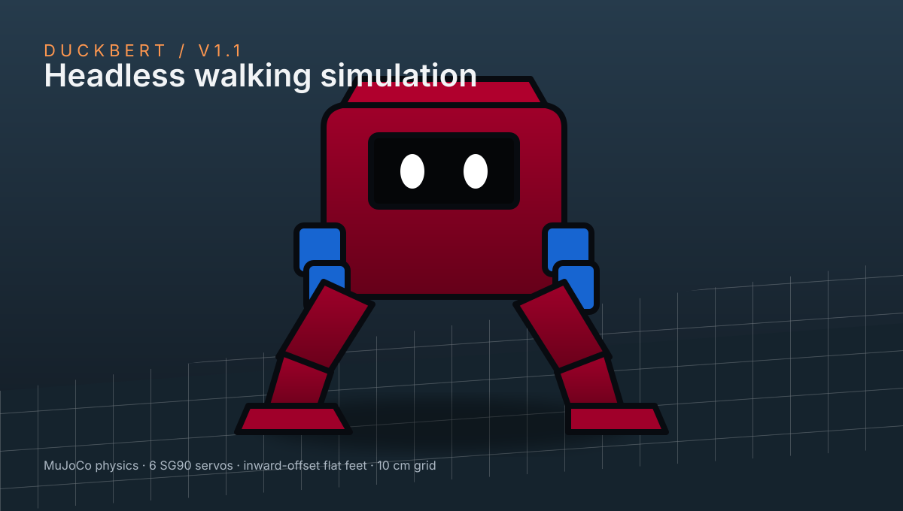

# Duckbert

**[Open the simulation](https://thinking0things.github.io/duckbert/)**



A headless SG90 robot with one walking gait and directional controls in the browser.
MuJoCo simulates gravity, contacts and six servomotors; Three.js renders the CAD meshes.
This is a standalone simulation with no connection to the physical robot.

## Controls

- **W / ↑**: walk forward.
- **S / ↓**: walk backward by reversing the phase of the same gait.
- **A / ←** and **D / →**: rotate left or right in place.
- **Space**: pause the simulation.
- With a mouse or touchscreen, tap a direction to keep moving; use **Pause** to freeze the simulation.
- **Reset to centre**: restore the starting position, orientation and gait phase.
- Drag to orbit the camera; scroll or pinch to zoom.

Directions are relative to the robot. Left and right rotate in place; combine them with W or ↑
for a walking turn. Pausing freezes simulation time; it is not a physical stopping controller.
The simulation also pauses when the page loses focus.

## Model and controller

The simulator imports all 32 neutral assembly meshes from `cad/out_none_v1.1`,
including the shorter body, LiPo cassette, compact hip block, ESP32-C3 shield and inward-offset
feet. The top colour button switches between Bordeaux red (`#800020`) and a white body
with orange feet and cyan frame, brackets and horns. Both options keep the six servos blue,
the screen black and the eyes white. The ground has a fixed white grid at 10 cm spacing.

Masses, centres of mass and inertias are derived from those meshes with solid PLA density
(1240 kg/m³), the CAD manifest's module mass estimates, and 22 g of wiring and fasteners.
These remain estimates, especially battery weight and printed infill. The flat 54 × 41 mm
sole contacts are centred at ±30.5 mm. Joint limits come from the v1.1 manifest.
Ground collisions use convex hulls for the printed parts and boxes for the soles; link-to-link
collisions are not simulated.

The single `v11_walk` gait uses the existing `none_oled` periodic controller, selected
after testing it on the imported model. Its steering sign is calibrated to this gait.

The controller implementation is ported from `gait9.py`, with position commands at 50 Hz, torque limits
and command slew limits. Steering varies the relative hip swing amplitude by up to 10%.
Backward movement reverses the same periodic trajectory. The controller does not directly
set the free body's position or orientation, or apply artificial steering forces.

The automated check runs 12 seconds of forward, left, right and backward movement in the WASM
engine, checking that the robot stays upright and turns in the expected direction. These are
nominal checks, not a stability guarantee for every sequence: prolonged turns, changes of direction
or numerical differences can cause falls. Backward movement may drift.

This flat-sole, no-ankle geometry is also the wall the walk runs into: see
[`docs/walking-limits.md`](docs/walking-limits.md) for what that costs it, in millimetres, and
the two unbuilt changes with the most headroom.

## Local development

Requires Node.js 22+ and Python 3 for the static server.

```sh
npm ci
npm run vendor
npm test
npm run serve
```

Open `http://127.0.0.1:8768`. The `dist/` folder includes all runtime dependencies and can also
be served by any static HTTP server. No API keys or backend are required.

## Run locally in MuJoCo

The repository also includes a native MuJoCo runner and English setup instructions in
[`mujoco/README.md`](mujoco/README.md). Install the Python dependency, then run
`python mujoco/run_viewer.py` to open the v1.1 model in MuJoCo's interactive viewer.

## GitHub Pages

The `main` branch contains source code, tests, data and pinned dependencies. The `gh-pages`
branch contains only the contents of `dist/`, served at the project site's root.

```sh
git add .
git commit -m "Update simulation"
git push origin main
git subtree split --prefix dist -b pages-release
git push origin pages-release:gh-pages
git branch -D pages-release
```

In Settings → Pages, select the `gh-pages` branch and the `/` folder.
Imports and assets use relative paths compatible with the project URL.

MuJoCo's threaded WebAssembly runtime requires cross-origin isolation. On GitHub Pages,
a project-scoped service worker adds the required COOP/COEP headers and reloads the page
once on the first visit. It does not cache assets or handle requests outside this origin.
Startup checks isolation before importing the engine and reports setup or loading failures
instead of leaving the loading screen indefinitely. Use HTTPS or localhost and a browser
that supports service workers and shared WebAssembly memory.

## Provenance and third-party licences

- Physics: [Google DeepMind MuJoCo](https://github.com/google-deepmind/mujoco), official
  `@mujoco/mujoco` package **3.6.0**, Apache-2.0; licence in `dist/vendor/mujoco/LICENSE`.
- Rendering: [Three.js](https://github.com/mrdoob/three.js) **0.178.0**, MIT;
  licence in `dist/vendor/three/LICENSE`.
- SG90 geometry and controller: the author's local Microduck project. The CAD reconstruction
  references the kinematic proportions of [pollen-robotics/microduck](https://github.com/pollen-robotics/microduck);
  upstream meshes are not included in this repository.

Model provenance is recorded in `dist/assets/provenance.json`.

## Reimporting CAD

With Python, NumPy and trimesh installed, run
`python scripts/import-cad.py /path/to/out_none_v1.1` and then `npm test`.
The importer uses neutral assembly exports, copies each STL unchanged, rebuilds mass properties
and collision placement, and records mesh checksums in the provenance file.
